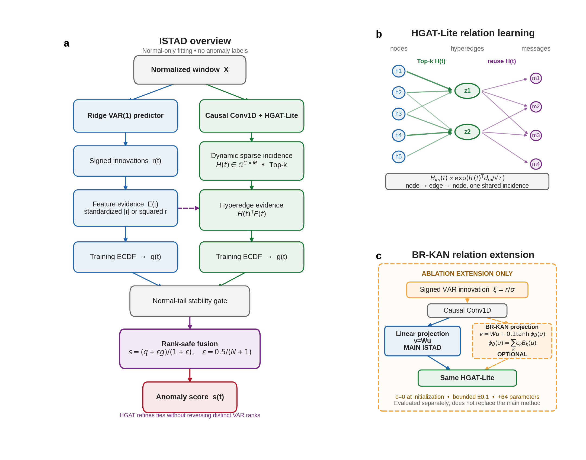
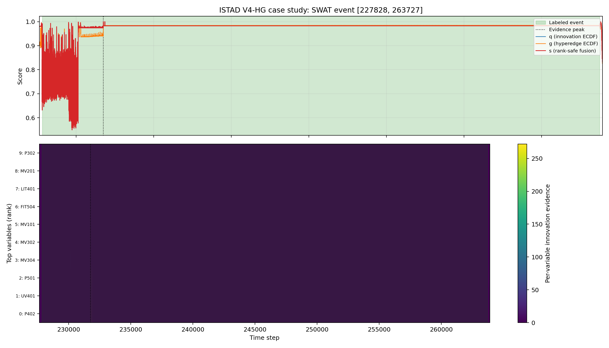

# ISTAD: Interpretable Rank-Safe Hypergraph Refinement of Causal Innovations for Multivariate Time-Series Anomaly Detection

> 中文方法稿。论文正文统一使用 **ISTAD**，不使用开发阶段版本号。本文所有公式与当前
> 冻结实现一致；BR-KAN 被限定为新息域关系映射扩展和消融对象。

## 3. Proposed Method

### 3.1 Problem formulation

给定多变量时间序列

\[
\mathbf X=\{\mathbf x_t\}_{t=1}^{T},\qquad
\mathbf x_t\in\mathbb R^C,
\]

其中 \(C\) 为变量数。训练集只包含正常样本，测试标签仅用于最终评价。目标是为每个
时刻输出连续异常分数 \(s_t\)，并在给定阈值 \(\tau\) 后得到

\[
\hat y_t=\mathbb I(s_t>\tau).
\]

训练序列首先按 80%/20% 的时间顺序划分为互不重叠的正常训练段和验证段。对原始变量
\(x^{\mathrm{raw}}_{t,i}\)，仅以正常训练段拟合

\[
\mu_i=\frac{1}{T_{\mathrm{tr}}}\sum_t x^{\mathrm{raw}}_{t,i},
\qquad
\nu_i^2=\frac{1}{T_{\mathrm{tr}}}\sum_t
(x^{\mathrm{raw}}_{t,i}-\mu_i)^2,
\qquad
d_i=
\begin{cases}
\sqrt{\nu_i^2}, & \nu_i^2>0,\\
1, & \nu_i^2=0,
\end{cases}
\qquad
x_{t,i}=\frac{x^{\mathrm{raw}}_{t,i}-\mu_i}{d_i}.
\]

对于包含多个实体的数据集，标准化、滞后配对、滑动窗口和事件调整均不跨实体边界。

### 3.2 Framework overview

ISTAD 由一条确定性的因果新息路径和一条轻量关系学习路径组成：



**Figure 1. Overall architecture of ISTAD.** (a) The main method fits a causal ridge
VAR model on normal training data, calibrates feature-level innovation evidence by the
training ECDF, and uses HGAT-Lite to dynamically aggregate that evidence. A normal-tail
stability gate and rank-safe fusion produce the final anomaly score. (b) HGAT-Lite uses
one sparse dynamic incidence matrix for node-to-hyperedge aggregation and reuses it for
hyperedge-to-node propagation. (c) BR-KAN replaces only the linear innovation-domain
relation projection and is evaluated as an ablation extension; it is not part of the
main ISTAD method. Dashed orange elements denote this optional extension.

新息路径负责提供可审计的逐变量异常证据；HGAT-Lite 不另行学习一个不受约束的异常头，
而是学习变量如何组成动态超边，并用该结构重新汇聚新息证据。最终融合受到严格的排序
约束，弱关系分支不能覆盖因果新息主排序。

### 3.3 Training-only causal innovations

#### 3.3.1 Ridge VAR estimation

记标准化后的正常训练点为 \(\mathbf x_t\)。ISTAD 使用一阶向量自回归：

\[
\hat{\mathbf x}_t=\mathbf x_{t-1}\mathbf A,
\]

其中 \(\mathbf A\in\mathbb R^{C\times C}\)。将所有合法的实体内滞后对写成设计矩阵
\(\mathbf D\) 和目标矩阵 \(\mathbf Y\)，则

\[
\mathbf A=
\left(\mathbf D^\top\mathbf D+\lambda_{\mathrm{VAR}}\mathbf I\right)^{-1}
\mathbf D^\top\mathbf Y,
\qquad \lambda_{\mathrm{VAR}}=10^{-2}.
\]

实现采用线性方程求解而非显式求逆；数值奇异时退化为最小二乘求解。测试数据不参与
系数估计。本文“因果”特指预测只使用当前时刻之前的信息，即时间上的严格因果性，并不
声称恢复结构因果图。时刻 \(t\) 的有符号新息为

\[
\mathbf r_t=\mathbf x_t-\mathbf x_{t-1}\mathbf A.
\]

每个实体的首个时刻不存在合法滞后项，其新息与证据在对齐输出中置为零。

#### 3.3.2 Robust feature scaling and evidence

对第 \(i\) 个变量，先在正常训练新息上计算标准差 \(\tilde\sigma_i\)，再施加尺度下界：

\[
\sigma_i=\max\left(
\tilde\sigma_i,
\eta\,\underset{j:\tilde\sigma_j>\varepsilon_0}{\operatorname{median}}
\tilde\sigma_j
\right),
\qquad \eta=0.1,\quad \varepsilon_0=10^{-8}.
\]

近常量变量比例完全由正常训练新息确定：

\[
\rho=\frac{1}{C}\sum_{i=1}^{C}
\mathbb I(\tilde\sigma_i\leq\varepsilon_0).
\]

当 \(\rho<0.1\) 时采用稀疏异常假设，逐变量证据和点级原始分数为

\[
e_{t,i}=\frac{|r_{t,i}|}{\sigma_i},
\qquad a_t=\max_i e_{t,i}.
\]

当 \(\rho\geq0.1\) 时采用稠密/退化通道假设：

\[
e_{t,i}=r_{t,i}^2,
\qquad a_t=\frac{1}{C}\sum_{i=1}^{C}e_{t,i}.
\]

该选择不读取测试数据或标签。设正常训练原始分数集合为
\(\mathcal R=\{a_j^{\mathrm{tr}}\}_{j=1}^{N}\)，右侧经验分布校准给出

\[
q_t=\widehat F_{\mathcal R}(a_t)
=\frac{\sum_{j=1}^{N}\mathbb I(a_j^{\mathrm{tr}}\leq a_t)+0.5}{N+1},
\qquad 0<q_t<1.
\]

因此 \(q_t\) 是只依赖正常训练参考集的因果新息分数。

### 3.4 HGAT-Lite relation learning

#### 3.4.1 Causal local encoder

对于长度为 \(W\) 的窗口，先使用仅左侧填充的一维卷积提取局部状态：

\[
\mathbf u_t=\operatorname{ReLU}
\left(\operatorname{Conv1D}_{\kappa}(\mathbf x_{\leq t})\right),
\qquad \mathbf u_t\in\mathbb R^C.
\]

由于卷积只在左侧填充，\(\mathbf u_t\) 不依赖任何 \(t\) 之后的观测。主方法使用线性
标量投影，将第 \(i\) 个节点的状态映射到秩为 \(r\) 的关系空间：

\[
\mathbf v_{t,i}=\mathbf W_v u_{t,i},\qquad
\mathbf h_{t,i}=\operatorname{LN}(\mathbf v_{t,i}+\mathbf p_i),
\]

其中 \(\mathbf p_i\in\mathbb R^r\) 是节点身份嵌入。

#### 3.4.2 Dynamic sparse incidence

令 \(\mathbf d_m\in\mathbb R^r\) 为第 \(m\) 条超边的可学习嵌入。节点—超边 logit 为

\[
\ell_{t,i,m}=\frac{\mathbf h_{t,i}^{\top}\mathbf d_m}{\sqrt r}.
\]

先沿节点维归一化：

\[
\bar H_{t,i,m}=
\frac{\exp(\ell_{t,i,m})}
{\sum_{j=1}^{C}\exp(\ell_{t,j,m})}.
\]

每条超边仅保留权重最大的 \(k\) 个节点；若某节点未被任何超边覆盖，则将其连接到当前
关联权重最大的超边。稀疏化后再次沿节点维归一化，得到动态关联矩阵
\(\mathbf H_t\in\mathbb R^{C\times M}\)，满足

\[
H_{t,i,m}\geq0,\qquad \sum_{i=1}^{C}H_{t,i,m}=1.
\]

#### 3.4.3 Node–edge–node propagation

节点状态先聚合到超边：

\[
\mathbf z_{t,m}=\operatorname{LN}
\left(\sum_{i=1}^{C}H_{t,i,m}\mathbf h_{t,i}\right).
\]

复用同一个关联矩阵完成反向传播。定义

\[
R_{t,i,m}=\frac{H_{t,i,m}}
{\sum_{m'=1}^{M}H_{t,i,m'}+\epsilon_n},
\]

则节点关系消息为

\[
\mathbf m_{t,i}=\sum_{m=1}^{M}R_{t,i,m}\mathbf z_{t,m},
\qquad
\widetilde{\mathbf m}_{t,i}=\operatorname{Dropout}(\mathbf m_{t,i}),
\]

\[
o_{t,i}=\sigma(\gamma)\left[
\mathbf w_o^{\top}\operatorname{GELU}(\widetilde{\mathbf m}_{t,i})+b_o
\right].
\]

这里 \(\sigma(\gamma)\) 是可学习消息门。复用关联矩阵避免了第二套密集节点—超边注意力，
同时保留可直接导出的 \(\mathbf H_t\) 作为关系解释。

### 3.5 Label-free neural training

HGAT-Lite 仅在正常训练窗口上训练。将因果卷积输出与关系输出拼接，并送入逐时刻解码器：

\[
\hat{\mathbf x}_t=\operatorname{MLP}
\left([\mathbf u_t\,\Vert\,\mathbf o_t]\right).
\]

解码器由 LayerNorm、宽度为 32 的线性层、SiLU、Dropout 和输出线性层组成，不跨时间
混合信息。干净重建损失为

\[
\mathcal L_{\mathrm{clean}}=
\frac{1}{BWC}\sum_{b,t,i}
(\hat x_{b,t,i}-x_{b,t,i})^2.
\]

为避免关系分支只学习恒等映射，在正常窗口上随机生成局部伪异常。每个窗口以 0.8 的
概率选择长度 \(L\sim U\{1,\ldots,\operatorname{round}(0.15W)\}\) 的时间段和
\(J\sim U\{1,\ldots,\operatorname{round}(0.2C)\}\) 个变量。对所选变量 \(i\)，令

\[
u_i\sim U(0.5,1.5),\qquad
A_i=1.5\,u_i\sigma_i^{(w)},\qquad
\delta_i=\zeta_i A_i,\quad
\zeta_i\in\{-1,+1\},
\]

其中 \(\sigma_i^{(w)}\) 是当前窗口标准差并下截至 0.1。四种等概率扰动分别为

\[
\widetilde x_{\ell,i}=
\begin{cases}
x_{\ell,i}+\delta_i, & \text{level shift},\\
x_{\ell,i}+A_i\varepsilon_{\ell,i},\quad
\varepsilon_{\ell,i}\sim\mathcal N(0,1), & \text{variance burst},\\
x_{\ell,i}+(0.2+0.8a_\ell)\delta_i, & \text{gradual trend},\\
x_{\ell,i}(1+0.5u_i)+0.25\delta_i, & \text{local gain},
\end{cases}
\]

其中 \(a_\ell\) 在所选时间段内从 0 线性变化到 1。记受扰位置集合为
\(\Omega\)，模型从扰动窗口 \(\widetilde{\mathbf X}\) 重建干净窗口。当
\(\Omega\) 与其补集均非空时，平衡去噪损失为

\[
\mathcal L_{\mathrm{denoise}}=
\frac{1}{2}
\left[
\frac{1}{|\Omega|}\sum_{j\in\Omega}(\hat x_j-x_j)^2+
\frac{1}{|\bar\Omega|}\sum_{j\in\bar\Omega}(\hat x_j-x_j)^2
\right].
\]

若某一集合为空，则只平均存在的损失项，与实现中的掩码逻辑一致。

最终训练目标为

\[
\mathcal L=\mathcal L_{\mathrm{clean}}
+0.5\mathcal L_{\mathrm{denoise}}.
\]

训练使用 Adam，初始学习率为 \(10^{-3}\)，并根据互不重叠的正常验证段上的同一无标签
训练目标执行早停。训练过程不访问测试集，也不使用真实异常标签。需要强调的是，神经
重建误差不直接充当最终
异常分数；神经网络的作用是学习动态关系矩阵 \(\mathbf H_t\)。

所有数据集固定使用关系秩 \(r=8\)、解码器宽度 \(h=32\)、Dropout 0.3 和初始学习率
\(10^{-3}\)。其余训练配置为

| Dataset | \(W\) | Batch | \(\kappa\) | \(M\) | \(k\) | Max epochs | Patience | LR schedule |
|---|---:|---:|---:|---:|---:|---:|---:|---|
| Exathlon | 100 | 128 | 7 | 9 | 3 | 20 | 5 | cosine |
| PSM | 64 | 128 | 7 | 12 | 5 | 3 | 3 | halve each epoch |
| SMD | 96 | 128 | 7 | 19 | 7 | 20 | 5 | cosine |
| SWaT | 96 | 64 | 15 | 20 | 10 | 12 | 4 | cosine |

### 3.6 Hypergraph evidence and rank-safe fusion

给定逐变量新息证据 \(e_{t,i}\) 和动态关联矩阵 \(H_{t,i,m}\)，超边证据为

\[
d_{t,m}=\sum_{i=1}^{C}H_{t,i,m}e_{t,i}.
\]

沿用新息路径由正常训练自动确定的池化模式：

\[
b_t=
\begin{cases}
\max_m d_{t,m}, & \rho<0.1,\\[2mm]
\dfrac{1}{M}\sum_{m=1}^{M}d_{t,m}, & \rho\geq0.1.
\end{cases}
\]

设正常训练超边原始证据为
\(\mathcal G=\{b_j^{\mathrm{tr}}\}_{j=1}^{N_g}\)，其右侧 ECDF 分数为

\[
g_t=\frac{1}{N_g}\sum_{j=1}^{N_g}
\mathbb I(b_j^{\mathrm{tr}}\leq b_t),\qquad g_t\in[0,1].
\]

随后只使用正常训练数据检查关系分支的尾部稳定性：每个实体的前 80% 正常点确定 99%
分位阈值，后 20% 正常点估计基础分数和图分数的尾部率 \(r_q,r_g\)。若

\[
r_g>1.25\max(0.01,r_q),
\]

则关闭关系分支并令 \(s_t=q_t\)。否则定义

\[
\epsilon_r=\frac{0.5}{N+1},
\qquad
s_t=\frac{q_t+\epsilon_r g_t}{1+\epsilon_r}.
\]

#### Proposition 1: rank preservation

对于任意两个具有不同新息 ECDF 排名的样本 \(a,b\)，若 \(q_a<q_b\)，则融合后仍有
\(s_a<s_b\)。

**Proof.** 不同经验排名至少相差一个步长：

\[
q_b-q_a\geq\frac{1}{N+1}=2\epsilon_r.
\]

又因为 \(g_t\in[0,1]\)，所以 \(g_b-g_a\geq-1\)。因此

\[
s_b-s_a
=\frac{(q_b-q_a)+\epsilon_r(g_b-g_a)}{1+\epsilon_r}
\geq\frac{2\epsilon_r-\epsilon_r}{1+\epsilon_r}>0.
\]

故 HGAT-Lite 对排序的影响仅限新息同分组内部，不能反转任何不同的新息经验排名。
\(\square\)

### 3.7 Thresholding and anomaly decision

ISTAD 首先输出连续分数 \(s_t\)。无阈值的 ROC-AUC 和 AUC-PR 直接由该分数计算。文献
兼容的 POT 评价先使用单调尾变换

\[
v_t=-\log(1-s_t),
\]

令数据集 \(d\) 的预设 SPOT 初始化分位为 \(l_d\)，乘子为 \(m_d\)，风险参数固定为
\(10^{-5}\)。归档评测器以正常训练分数初始化 SPOT，然后把无标签测试分数流传入并以
`dynamic=False` 运行。若其阈值轨迹为 \(\{\theta_t\}_{t=1}^{T}\)，则

\[
\bar\theta=\frac{1}{T}\sum_{t=1}^{T}\theta_t,
\qquad
\tau_{\mathrm{POT}}=1.04\,m_d\bar\theta.
\]

所用固定参数为

| Dataset | \(l_d\) | \(m_d\) |
|---|---:|---:|
| Exathlon | 0.9900 | 1.0 |
| PSM | 0.9800 | 0.9 |
| SMD | 0.9880 | 1.0 |
| SWaT | 0.9999 | 1.2 |

最终逐点预测为 \(\hat y_t=\mathbb I(v_t>\tau_{\mathrm{POT}})\)。该 POT 实现不读取测试
标签，但因阈值轨迹接收无标签测试分数，应如实标注为**转导式兼容协议**，不能直接宣称
为严格训练侧部署阈值。Point adjustment 只是事后评价协议，不参与训练或连续打分。测试
标签搜索得到的 Best-F1 仅作为 oracle 上限，不能解释为可部署性能。

### 3.8 BR-KAN innovation-domain relation extension

为了检验非线性关系映射是否能更好地刻画突变方向，扩展模型将 HGAT-Lite 的输入由原始
标准化值替换为有符号标准化新息

\[
\xi_{t,i}=\frac{r_{t,i}}{\sigma_i}.
\]

该表示保留异常变化的方向，而新息系数与尺度仍只由正常训练数据拟合。经过因果卷积后，
原线性标量投影被有界残差 KAN 映射替换：

\[
\phi_j(u)=w_j u+\alpha
\tanh\left(\sum_{k=1}^{K}c_{j,k}B_k(\bar u)\right),
\qquad \bar u=4\tanh(u/4),
\]

其中 \(\alpha=0.1\)，三阶 B-spline 使用 5 个网格区间，故 \(K=5+3=8\)。样条系数
\(c_{j,k}\) 零初始化，因此训练开始时

\[
\phi_j(u)=w_j u,
\]

扩展模型精确嵌套线性投影；非线性修正幅度被限制在 \([-0.1,0.1]\)。当关系秩
\(r=8\) 时，该扩展只增加 \(rK=64\) 个可训练参数。

令扩展均匀节点序列为 \(\{t_k\}\)。代码使用的 Cox--de Boor 基递推为

\[
B_{k,0}(z)=\mathbb I(t_k\leq z<t_{k+1}),
\]

\[
B_{k,p}(z)=
\frac{z-t_k}{t_{k+p}-t_k}B_{k,p-1}(z)
+
\frac{t_{k+p+1}-z}{t_{k+p+1}-t_{k+1}}B_{k+1,p-1}(z),
\quad p=1,2,3,
\]

其中零分母按数值下界 \(10^{-8}\) 处理，最终使用 \(B_k=B_{k,3}\)。

为了在消融中观察完整的排序贡献，线性和 BR-KAN 两个新息域关系模型使用相同的训练侧
可靠性混合，而不是主方法的保序融合。若稳定性检查未关闭图分支，令

\[
\omega=0.2\min\left(
1,
\frac{0.01+|r_q-0.01|}
{0.01+|r_g-0.01|+\epsilon_n}
\right),
\]

\[
\tilde s_t=(1-\omega)q_t+\omega g_t,
\qquad
s_t^{\mathrm{ext}}=\widehat F_{\tilde s^{\mathrm{tr}}}(\tilde s_t).
\]

该混合及其 ECDF 仍只依赖正常训练数据，但不具有 Proposition 1 的保序保证，因此只作为
关系映射扩展的机制实验，不替换主方法。

### 3.9 Training algorithm

```text
Algorithm 1: Training ISTAD
Input: normal training sequence Xtr; window length W
1: Split each entity chronologically into disjoint training/validation parts.
2: Fit the feature standardizer on the normal training part only.
3: Fit ridge VAR(1); store A, residual scales σ, pooling mode, and ECDF reference R.
4: Construct clean normal windows without crossing entity boundaries.
5: For each mini-batch:
     a. Encode windows with the causal convolution.
     b. Generate sparse dynamic incidence H with HGAT-Lite.
     c. Reconstruct clean windows and compute Lclean.
     d. Inject one of four local corruptions and compute balanced Ldenoise.
     e. Update neural parameters using L = Lclean + 0.5 Ldenoise.
6: Select the checkpoint by the same label-free objective on normal validation windows;
   never inspect test loss.
Output: VAR state, ECDF references, HGAT-Lite, and pointwise decoder.
```

### 3.10 Anomaly scoring algorithm

```text
Algorithm 2: Scoring with ISTAD
Input: fitted ISTAD; an entity-aware sequence X
1: Compute causal VAR innovations r and feature evidence E.
2: Pool E and apply the training ECDF to obtain the base score q.
3: Run the causal convolution and HGAT-Lite to obtain incidence H.
4: Aggregate E through H, pool hyperedges, and apply the graph training ECDF to obtain g.
5: Evaluate the graph tail-stability gate using normal training data only.
6: If the gate fails, return s = q; otherwise return rank-safe score
       s = (q + [0.5/(N+1)]g) / (1 + 0.5/(N+1)).
7: Report continuous s for ROC/AP, or transform s and apply the transductive POT protocol.
Output: point scores s, predictions, feature evidence E, and dynamic incidence H.
```

## 4. Complexity Analysis

令 \(C\) 为变量数、\(M\) 为超边数、\(r\) 为关系秩、\(k\) 为每条超边保留节点数、
\(\kappa\) 为因果卷积核宽度、\(h\) 为解码器宽度、\(W\) 为窗口长度，\(T_{\mathrm{tr}}\)
为正常训练点数。

### 4.1 Time complexity

一阶 VAR 的闭式拟合需要

\[
\mathcal O(T_{\mathrm{tr}}C^2+C^3)
\]

时间和 \(\mathcal O(C^2)\) 参数存储；拟合只执行一次。VAR 推理为
\(\mathcal O(TC^2)\)。正常训练 ECDF 的排序成本为
\(\mathcal O(T_{\mathrm{tr}}\log T_{\mathrm{tr}})\)，每个查询通过二分搜索完成，长度为
\(T\) 的序列共需 \(\mathcal O(T\log T_{\mathrm{tr}})\)。

对单个长度为 \(W\) 的窗口，神经关系路径的主要开销为

\[
\mathcal O\left(
W\kappa C^2+WCMr+WCh
\right).
\]

其中三项分别对应密集通道因果卷积、节点—超边传播和逐点解码。Top-k 选择额外需要约
\(\mathcal O(WMC\log k)\)。由于默认 \(r=8\)、\(M\approx C/2\)，关系传播避免了高维
方阵变换和显式四维注意力张量。

BR-KAN 扩展增加

\[
\mathcal O(WCKr)
\]

的样条投影计算，其中 \(K=8\)，不改变 HGAT 的渐近主项。

当评分窗口以步长 \(W\) 无重叠覆盖长度为 \(T\) 的序列时，端到端推理复杂度为

\[
\mathcal O\left(
T[C^2+\kappa C^2+CMr+Ch+MC\log k+\log T_{\mathrm{tr}}]
\right).
\]

### 4.2 Space complexity

单个时间点需要保存关联矩阵和低秩状态：

\[
\mathcal O\left(CM+(C+M)r\right).
\]

一个窗口的主要激活内存为

\[
\mathcal O\left(W[CM+(C+M)r+Ch]\right).
\]

稀疏化后的每条超边仅保留 \(k\) 个有效节点，导出解释结果时可压缩为
\(\mathcal O(WMk)\)，当前实现为便于 GPU 批处理仍保存稠密关联张量。
除神经激活外，闭式分支还保存 \(\mathcal O(C^2)\) 个 VAR 系数以及
\(\mathcal O(T_{\mathrm{tr}}+N_g)\) 个排序后的 ECDF 参考值。

### 4.3 Parameter complexity

线性 HGAT-Lite 的参数量为

\[
P_{\mathrm{HGAT}}=r(C+M+6)+2.
\]

因果卷积参数量为 \(\kappa C^2+C\)，逐点解码器参数量为
\(3Ch+5C+h\)。因此神经分支总参数量为

\[
P_{\mathrm{ISTAD}}=
\kappa C^2+C+[r(C+M+6)+2]+[3Ch+5C+h].
\]

BR-KAN 扩展后的参数量为

\[
P_{\mathrm{ISTAD+BRKAN}}=P_{\mathrm{ISTAD}}+rK.
\]

当前配置 \(r=8,h=32,K=8\) 的精确参数量如下。表中均为神经分支的可训练参数；闭式
VAR 另含 \(C^2\) 个非梯度系数。

| Dataset | \(C\) | \(W\) | \(M\) | \(k\) | ISTAD params | HGAT params | +BR-KAN | BR-KAN total |
|---|---:|---:|---:|---:|---:|---:|---:|---:|
| Exathlon | 19 | 100 | 9 | 3 | 4,771 | 274 | 64 | 4,835 |
| PSM | 25 | 64 | 12 | 5 | 7,303 | 346 | 64 | 7,367 |
| SMD | 38 | 96 | 19 | 7 | 14,522 | 506 | 64 | 14,586 |
| SWaT | 51 | 96 | 20 | 10 | 44,867 | 618 | 64 | 44,931 |

### 4.4 Measured efficiency

在 NVIDIA RTX A6000、PyTorch 2.6.0、30 次预热和 100 次测量下，主方法的神经前向
效率如下。测量包含动态关联矩阵输出，不包含数据加载和一次性的 VAR 拟合。

| Dataset | Production batch | ms/batch | μs/window | Peak allocated memory | Checkpoint |
|---|---:|---:|---:|---:|---:|
| Exathlon | 128 | 3.838±0.083 | 29.99 | 62.7 MiB | 25.2 KiB |
| PSM | 128 | 3.150±0.360 | 24.61 | 65.9 MiB | 35.2 KiB |
| SMD | 128 | 7.027±0.020 | 54.90 | 198.1 MiB | 63.3 KiB |
| SWaT | 64 | 4.533±0.014 | 70.83 | 141.9 MiB | 181.9 KiB |

## 5. BR-KAN Projection Ablation

为隔离关系映射的作用，线性投影和 BR-KAN 投影使用完全相同的新息输入、HGAT-Lite、
去噪训练、可靠性混合、数据划分与随机种子，仅改变标量关系投影。

| Dataset | Linear AP | BR-KAN AP | ΔAP | Linear ROC | BR-KAN ROC | ΔROC |
|---|---:|---:|---:|---:|---:|---:|
| Exathlon | 0.453607 | 0.454850 | +0.001243 | 0.836411 | 0.836895 | +0.000484 |
| PSM | 0.432003 | 0.428805 | -0.003198 | 0.660782 | 0.658022 | -0.002761 |
| SMD | 0.125330 | 0.127282 | +0.001952 | 0.688875 | 0.689605 | +0.000730 |
| SWaT | 0.532461 | 0.564416 | +0.031955 | 0.847506 | 0.857717 | +0.010210 |
| **Macro** | **0.385850** | **0.393838** | **+0.007988** | **0.758394** | **0.760559** | **+0.002166** |

| Dataset | Linear POT+PA | BR-KAN POT+PA | Δ | Linear Best-F1+PA | BR-KAN Best-F1+PA | Δ |
|---|---:|---:|---:|---:|---:|---:|
| Exathlon | 0.962009 | 0.961231 | -0.000778 | 0.963790 | 0.963512 | -0.000278 |
| PSM | 0.966810 | 0.966600 | -0.000211 | 0.981460 | 0.979426 | -0.002034 |
| SMD | 0.849997 | 0.840440 | -0.009557 | 0.883572 | 0.890056 | +0.006484 |
| SWaT | 0.815097 | 0.827348 | +0.012251 | 0.954012 | 0.953618 | -0.000394 |
| **Macro** | **0.898478** | **0.898905** | **+0.000426** | **0.945708** | **0.946653** | **+0.000944** |

BR-KAN 的 Macro AP 提高 0.007988，且在 3/4 数据集取得非负 AP 变化，因此满足预先固定
的保留规则。该结果支持“有界样条残差有助于新息域关系映射”，但实验只有一个开发种子，
且 PSM 上 AP/ROC 均下降，不能表述为跨数据集一致改善、统计显著或主方法的必选组件。

## 6. Interpretability Analysis

ISTAD 的可解释性来自第 3 节定义的三层显式对象：逐变量因果新息证据
\(e_{t,i}\)（闭式解、无随机状态）、动态关联矩阵 \(H_{t,i,m}\)（可导出）与超边证据
\(d_{t,m}\)。本节给出三组对应的经验证据：(i) 真实案例研究（6.1）；(ii) 无标签合成
注入下的变量定位指标（6.2）；(iii) 跨种子稳定性与声明边界（6.3）。全部实验遵循
预注册协议 `analysis/v4hg_interpretability/PREREGISTERED_PROTOCOL.md`（冻结于
2026-09-15，先于任何运行写入）：测试标签只用于事后选择展示事件，任何阈值、权重、
模型或协议选择均不依赖测试标签或测试分数；变量定位阶段完全在无标签的正常验证
holdout 上进行。单一入口
`python analysis/evaluate_v4hg_interpretability.py --stage all` 固定种子 87，
重复运行逐字节复现全部 JSON/CSV 输出。

### 6.1 Real case studies

选例规则在运行前固定：每个数据集取平铺测试序列中**最长**的连续标注事件（并列取
最早起点；SMD 在单一实体内部取段），标签只参与选例，不参与任何评分或阈值。对选中
事件使用 seed-87 冻结 checkpoint 前向，导出事件 ± 2W 上下文内的 \(q_t\)（新息 ECDF）、
\(g_t\)（训练图证据 ECDF）、\(s_t\)（保序融合）三条分数曲线、逐变量证据热图，以及
事件证据峰值点的 \(H_t\) 行快照（每个 top-5 变量的 top-1 超边归属与权重）和
\(d_{t,m}\) 排序。

**表 X：真实案例概览（seed-87）**

| Dataset | Event [start, end] | Length | Entity | Top-1 variable | Peak \(q_t\) | Peak \(g_t\) | Peak \(s_t\) |
|---|---|---:|---:|---|---:|---:|---:|
| EXA | [7973, 8644] | 672 | – | var_16 | 1.000 | 1.000 | 1.000 |
| PSM | [17991, 26851] | 8861 | – | var_20 | 1.000 | 1.000 | 1.000 |
| SMD | [392913, 396073] | 3161 | 16 | var_9 | 1.000 | 0.998 | 1.000 |
| SWaT | [227828, 263727] | 35900 | – | P402 | 1.000 | 0.997 | 1.000 |

SWaT 案例的 top-5 变量为 P402、UV401、P501、MV304、MV302，直接对应数据集
CSV 的真实传感器/执行器列名——证据不需要事后归因技术即可映射到工程语义。事件峰值
处各分量的 \(H_t\) 行给出每个变量的超边归属（如 SWaT 峰值点 P402、UV401、P501 同属
超边 3，权重约 0.04），峰值点 \(d_{t,m}\) 的完整排序随案例 JSON 一并导出。
图 2 展示 SWaT 案例；EXA/PSM/SMD 的同款双栏图见
`paper/figures/fig_case_{exa,psm,smd}.png` 与 `analysis/v4hg_interpretability/case_studies/`。



**Figure 2. SWaT real case study**（最长标注事件 [227828, 263727]）。上：\(q_t/g_t/s_t\)
三条分数曲线与标注事件（绿色）；下：top-10 变量的逐点证据热图，纵轴为证据排名与真实
列名，虚线为证据峰值点。

每个案例在写盘前必须通过三个等价性锚点：(1) 重算 \(q_t\) 与归档冻结分数
（`analysis/istad_v4_innovation/<DS>_innovation_scores.npz`）在同指标下最大绝对差
\(\le 2.98\times10^{-8}\)（容差 \(10^{-6}\)，差异来自归档的 float32 序列化）；
(2) seed-87 checkpoint 的 sha256 与 E1 材料护照一致；(3) 训练窗图分数缓存按位复现。
四个数据集全部通过。

### 6.2 Injection-based variable localization

变量定位缺乏逐变量真值，因此采用注入式协议：在每个数据集的正常验证 holdout（训练
尾部 20%，无标签）上注入 \(N=200\) 段合成异常（4 族 × 50：持续水平偏移、方差爆发、
渐变趋势、局部增益+偏移；公式与第 3.5 节训练去噪腐蚀完全一致，不引入新超参）。每段
时长 \(L\sim U\{1..\lceil0.15W\rceil\}\)，注入变量数 \(J\sim U\{1..\lceil0.2C\rceil\}\)，
幅度 \(A_i=1.5\,u_i\,\sigma_w\)（\(\sigma_w\) 为该变量在段末 \(W\) 窗口内的标准差、
下限 0.1），符号等概率。每次注入在独立副本上进行后即复原，注入之间互不干扰。

对每个注入点按 \(e_{t,i}\) 降序排名被注入变量，指标在段内取平均、再对注入取平均
（bootstrap 95% CI，1000 次重抽样，种子 2026）：Hit@1（榜首变量被注入）、
Precision@\(J\)（前 \(J\) 名中注入变量占比）、MRR（最佳注入变量的倒数排名）。
基线为无模型的一阶差分幅值 \(|\Delta x_{t,i}|\) 与机会水平 \(J/C\)。

**表 Y：注入式变量定位（mean [bootstrap 95% CI]，N=200/数据集）**

| Dataset | Hit@1（证据） | Hit@1（一阶差分） | 机会 \(J/C\) | Precision@J（证据） | MRR（证据） | Gate |
|---|---|---|---:|---|---|---|
| EXA | 0.431 [0.387, 0.477] | 0.298 [0.256, 0.344] | 0.138 | 0.331 [0.302, 0.360] | 0.588 [0.553, 0.625] | PASS |
| PSM | 0.361 [0.313, 0.405] | 0.270 [0.228, 0.317] | 0.116 | 0.286 [0.258, 0.314] | 0.515 [0.478, 0.553] | PASS |
| SMD | 0.424 [0.368, 0.476] | 0.263 [0.219, 0.305] | 0.113 | 0.294 [0.267, 0.324] | 0.561 [0.519, 0.603] | PASS |
| SWaT | 0.577 [0.525, 0.627] | 0.441 [0.389, 0.492] | 0.102 | 0.538 [0.500, 0.574] | 0.727 [0.692, 0.762] | PASS |

四个数据集上，闭式证据的三个指标均优于一阶差分基线（CI 不重叠），且 Hit@1 的 CI
下界均高于机会水平——预注册 sanity gate 全部通过。这表明变量定位能力来自可审计的
因果新息证据本身，而非任何基于梯度的事后归因。

### 6.3 Stability and claim boundary

稳定性证据分三层。

- **S1（注入间稳定性）**：6.2 的 bootstrap CI 即为逐数据集的抽样稳定性。
- **S2（跨种子 \(H_t\) 一致性）**：三个冻结种子（87/90/98）的 checkpoint 对同一
  事件窗口前向，逐点计算变量→top-1 超边归属的平均 Jaccard 一致度，以及峰值点
  \(d_{t,m}\) 向量的 Kendall \(\tau\)。

**表 Z：跨种子 \(H_t\) 一致性（seed 对）**

| Dataset | Pair | Mean top-1-edge Jaccard | Kendall \(\tau\)（峰值 \(d_{t,m}\)） |
|---|---|---:|---:|
| EXA | 87–90 | 0.049 | 0.167 |
| EXA | 87–98 | 0.071 | −0.278 |
| EXA | 90–98 | 0.057 | −0.111 |
| PSM | 87–90 | 0.015 | −0.121 |
| PSM | 87–98 | 0.033 | −0.273 |
| PSM | 90–98 | 0.021 | −0.061 |
| SMD | 87–90 | 0.024 | −0.287 |
| SMD | 87–98 | 0.017 | −0.018 |
| SMD | 90–98 | 0.018 | −0.088 |
| SWaT | 87–90 | 0.021 | −0.168 |
| SWaT | 87–98 | 0.009 | 0.074 |
| SWaT | 90–98 | 0.022 | −0.021 |

- **S3（证据分支种子无关）**：\(e_{t,i}\) 为闭式解，不含随机状态，跨种子逐位相同
  （构造性事实，非经验测量）。

表 Z 的诚实结论是：导出的 \(H_t\) 不是跨种子稳定的结构对象，两种一致性指标都处于
机会水平附近。这一结果必须与声明边界一起解读，我们在论文中固定如下边界声明：

> E1 的度保持反事实审计已证明学习关联矩阵对检测度量是度量不变的（替换
> \(H_t\) 仅造成 \(\sim10^{-4}\) 量级指标变化），R1 的掩码通道门控未通过；因此
> 变量定位能力归因于**可审计的因果新息证据分支**，\(H_t\) 只作为该证据的透明关系
> 组织呈现，其对分数的贡献被保序约束（命题 1）限制在同 ECDF 组内部的并列细化。
> 6.3 的跨种子结果与此一致：\(H_t\) 的结构随种子变化，但由 E1 该变化不传播为检测
> 度量的变化。工程上应以 \(e_{t,i}\)（与 \(q_t\)）作为主解释对象，\(H_t\) 作为
> 辅助的关系视图。

综上，ISTAD 的"Interpretable"声明落在三个可核验事实上：(i) 主分数由闭式、
种子无关、标签无关的逐变量证据构成（6.2、S3）；(ii) 案例研究展示证据可直接映射到
真实变量语义（6.1）；(iii) 图结构的位置被明确限定为透明的证据组织而非性能或解释
来源（6.3、E1、R1）。

## 7. Reproducibility and Claim Boundary

1. 正文中的方法名称统一为 ISTAD；Linear 和 BR-KAN 只作为消融设置名称。
2. 主方法使用因果新息、HGAT-Lite 和保序融合；BR-KAN 是新息域关系映射扩展。
3. 所有 VAR 参数、残差尺度、池化选择、ECDF 和可靠性门只读取正常训练数据；归档 POT
   阈值不读取测试标签，但接收无标签测试分数流，因此单独标注为转导式兼容协议。
4. 主结果使用三个固定种子报告均值与总体标准差；BR-KAN 消融只逐值报告单种子结果。
5. POT+PA 是文献兼容指标，Best-F1+PA 是测试标签 oracle；两者都不能替代无 PA 的
   ROC-AUC、AUC-PR、裸 F1 和事件级指标。
6. 当前结果只能表述为在项目存档基线和既定实验口径下的表现，不能外推为当前领域 SOTA。
